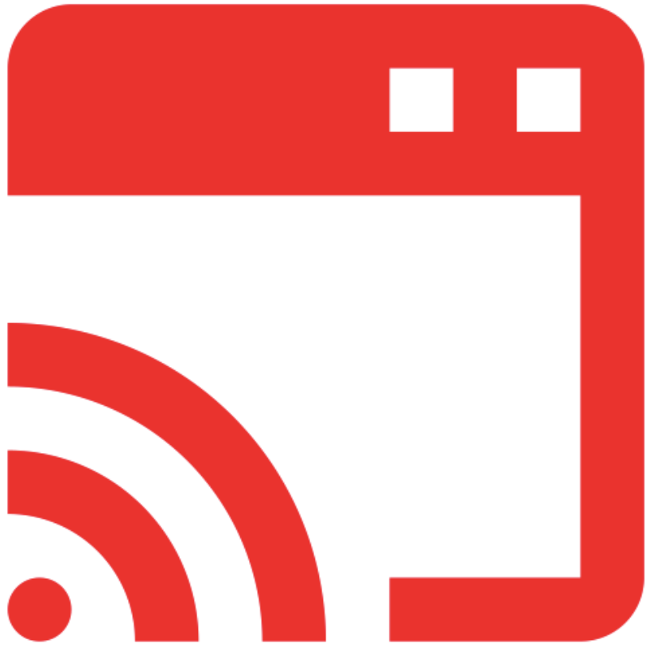

# Knowledge Mobilization - An Introduction

- Pre-workshop activities: 10 min 
- Introductory presentation: 10 min
- Hands-on activities: 40-70 min

## Why is Knowledge Mobilization Important? 

Knowledge  obilization (KM) is important for several reasons, and researchers should care about it because it can have a significant impact on the reach and impact of their research. Here are some specific reasons why knowledge mobilization is important:

1. **Bridge the gap between research and practice**: Often, research findings are published in academic journals and are not accessible or understandable to decision makers who could benefit from them. Knowledge mobilization helps to bridge this gap by making research findings accessible and understandable to practitioners, policymakers, and other stakeholders who can use them to inform decision-making.
2. **Broaden the impact of research**: By mobilizing knowledge, researchers can increase the reach and impact of their work to the broader pubic. This can lead to greater uptake of research findings and more significant contributions to positive social, economic, and environmental outcomes.
3. **Building stronger community partnerships and collaborations**: Knowledge mobilization can help researchers build stronger partnerships and collaborations with stakeholders outside of academia. This can lead to better-informed research questions, more relevant research findings, and greater uptake of research results.
4. **Fostering innovation**: By sharing knowledge and collaborating with stakeholders outside of academia, researchers can contribute to the development of new practices, products, and services that can improve society and the economy.

Learning how to use Knowledge Mobilization tools can help researchers ensure that their work has a meaningful postive impact on society.

## Learning objectives

At the end of this workshop, you will be able to:

1. **MORE OBJECTIVES**
 
[NEXT STEP: Pre-Workshop Activities](pre-workshop.html){: .btn .btn-blue }
